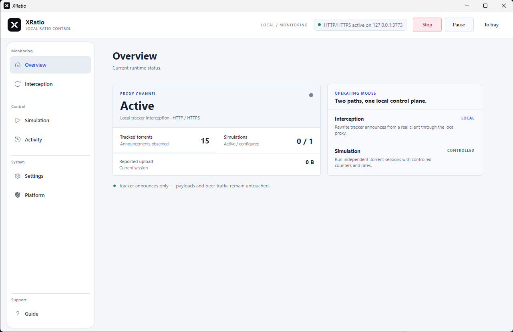

# XRatio

[](https://github.com/Mac-Cipher/XRatio)


> A native control plane for tracker announce interception and controlled torrent simulation.

XRatio is a Windows-first .NET 10 / Avalonia desktop application for people who need a clear, local view of tracker announces. It brings two deliberately separate workflows into one compact tool:

- **Interception** — a local HTTP/HTTPS proxy inspired by [RatioGhost](https://github.com/ratioghost/ratioghost) rewrites tracker announces from a real torrent client while leaving payload and peer traffic alone.
- **Simulation** — an independent engine inspired by [RatioMaster.NET](https://github.com/NikolayIT/RatioMaster.NET) reads `.torrent` metadata and runs tracker sessions with explicit counters, speeds, and client profiles.

<p align="center">
  
</p>

<p align="center">
  <a href="https://github.com/Mac-Cipher/XRatio/releases/latest"><strong>Download the latest Windows build</strong></a>
  ·
  <a href="README.fr.md">Lire la documentation en français</a>
</p>

**Windows-first · Avalonia · .NET 10 · GPL-3.0**

## Product surface

| View | What it is for |
| --- | --- |
| **Overview** | Confirm proxy health, tracked torrents, simulations, and reported upload at a glance. |
| **Interception** | Inspect real and rewritten announce counters, peers, status, and last announce per info-hash. |
| **Simulation** | Load a `.torrent`, choose a tracker and client profile, configure speeds, then control a session explicitly. |
| **Activity** | Follow proxy and simulation events without digging through raw logs. |
| **Settings** | Configure language, themes, accents, ratio rules, logging, autostart, and check the installed version against the official GitHub release. |
| **Platform** | Opt in to HTTPS interception and manage the local CA trust for the current Windows user. |

## Design principles

- **One control plane, two paths.** Interception and simulation remain visibly separate so a real client session is never confused with an independent simulation.
- **Local and explicit.** The proxy is bound locally by default (`127.0.0.1:3773`), and HTTPS trust requires a deliberate confirmation.
- **Fail closed.** Direct tracker simulation keeps the operating system's TLS validation; XRatio does not copy the legacy accept-all certificate behavior.
- **Observable by default.** Counters, statuses, activity, and validation messages stay close to the action that produced them.

## Download and run

End users should use the packaged Windows build from [Releases](https://github.com/Mac-Cipher/XRatio/releases). The self-contained package does not require a separate .NET installation.

When running from source, the desktop app starts with:

```powershell
dotnet run --project .\src\XRatio.Desktop\XRatio.Desktop.csproj
```

The first launch keeps simulations stopped. Configured sessions are stored in `%APPDATA%\XRatio\simulations.json`; the proxy password is never persisted.

## Build, test, and package

Prerequisite: .NET SDK `10.0.302`.

```powershell
dotnet restore .\XRatio.slnx
dotnet build .\XRatio.slnx -c Release --disable-build-servers -m:1
dotnet test .\XRatio.slnx -c Release --disable-build-servers -m:1
```

Create and smoke-test the self-contained Windows package:

```powershell
.\scripts\package-win-x64.ps1
.\scripts\smoke-win-x64.ps1
```

Installed-qBittorrent smoke tests are opt-in. Enable them only when an isolated qBittorrent launch is acceptable:

```powershell
$env:XRATIO_RUN_QBITTORRENT_SMOKE='1'
dotnet test .\tests-dotnet\XRatio.Desktop.Tests\XRatio.Desktop.Tests.csproj -c Release
```

## Repository layout

```text
src/XRatio.Core        shared announce, torrent, simulation, and settings logic
src/XRatio.Proxy       local HTTP/HTTPS proxy and redacted activity logging
src/XRatio.Desktop     Avalonia desktop shell, tray, themes, localization, and platform trust
tests-dotnet            Core, Proxy, and Desktop test suites
scripts                 Windows packaging and smoke-test entry points
```

## Responsible use

Trackers can prohibit modified or simulated statistics. Use XRatio only with services and torrents for which you are authorized, and follow the tracker rules and applicable law. XRatio handles tracker announces only; it is not a peer-to-peer client and does not process payload traffic.

## Inspiration and provenance

This repository was developed with **OpenAI Codex**.

XRatio is an independent .NET 10/Avalonia implementation inspired by two existing projects:

- **[RatioGhost](https://github.com/ratioghost/ratioghost)** — inspiration for the announce/proxy workflow, local platform integration, certificates, tray behavior, packaging, and verification boundaries.
- **[RatioMaster.NET](https://github.com/NikolayIT/RatioMaster.NET)** — inspiration for the `.torrent` simulation workflow, tracker sessions, client profiles, counters, speed variation, and announce lifecycle.

The complete attribution is available in [THIRD_PARTY_NOTICES.md](THIRD_PARTY_NOTICES.md).

## License

XRatio is distributed under the [GNU GPL v3](license.txt). Third-party attributions are listed in [THIRD_PARTY_NOTICES.md](THIRD_PARTY_NOTICES.md).
